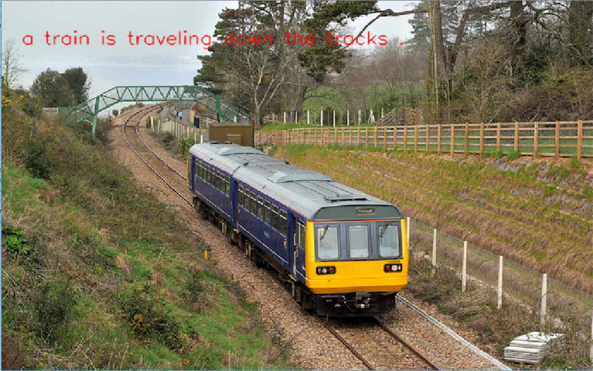

# Image Captioning Project
## Accomplished as a required project for Udacity Computer Vision Nanodegree 

## Project Overview
This is the second project of the Udacity Computer Vision course. 
In this project, I used 1 layer GRU (Gated Recurrent Units) to generate 
captions for Coco dataset images.

*The jupyter notebooks for the project submission are also included. The files are:  * 

__Notebook 1__ : Loading and Visualizing the Data

__Notebook 2__ : Preliminaries to learn how the tokenizer works and how vocabulary sizes matters.

__Notebook 3__ : Train the RNN model

__Notebook 4__ : Use the trained model to generate captions for test images

### Local Environment Instructions


1. Clone the repository, and navigate to the downloaded folder. This may take a minute or two to clone due to the included image data.
```
git clone https://github.com/alarafat/Image_Captioning.git
cd image_captioning
```

2. Create (and activate) a new environment named `cv-nd` with all the required packages, 
run the 'create_and_set_environment.bat' file. If prompted to proceed 
with the install `(Proceed [y]/n)` type y.
```shell
create_and_set_environment.bat
proceeed with [y]

### Environemnt
The bat file will create a conda environment usinf python 3.6 with the required pip and 
conda packages specified in the requirement files in /requirements subdirectory.

```
### Setting up CocoAPI and downloading Coco dataset
1. Clone this repo: https://github.com/cocodataset/cocoapi  
```
git clone https://github.com/cocodataset/cocoapi.git  
```

2. Setup the coco API (also described in the readme [here](https://github.com/cocodataset/cocoapi)) 
```
cd cocoapi/PythonAPI  
make  
cd ..
```

3. Download some specific data from here: http://cocodataset.org/#download (described below)

* Under **Annotations**, download:
  * **2014 Train/Val annotations [241MB]** (extract captions_train2014.json and captions_val2014.json, and place at locations cocoapi/annotations/captions_train2014.json and cocoapi/annotations/captions_val2014.json, respectively)  
  * **2014 Testing Image info [1MB]** (extract image_info_test2014.json and place at location cocoapi/annotations/image_info_test2014.json)

* Under **Images**, download:
  * **2014 Train images [83K/13GB]** (extract the train2014 folder and place at location cocoapi/images/train2014/)
  * **2014 Val images [41K/6GB]** (extract the val2014 folder and place at location cocoapi/images/val2014/)
  * **2014 Test images [41K/6GB]** (extract the test2014 folder and place at location cocoapi/images/test2014/)


### Run the notebooks
6. Open the directory of notebooks, run the 'run_notebook.bat' file. This file will activate the conda environment `cv-nd`
and open the notebook in the browser. Open the notebooks and follow the instructions.
```shell
run_notebook.bat
```

**Results**

<p align="center">
  
</p>

